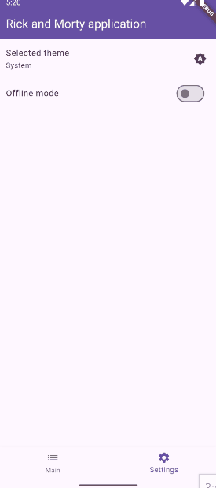
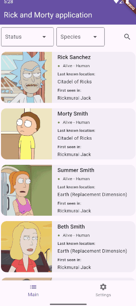

# Rick and Morty App

Run:

```sh
fvm global stable
```

```sh
flutter pub get
```

```sh
flutter run
```

<div style="display: flex; flex-wrap: wrap; gap: 20px; justify-content: center;">
  <div style="text-align: center;">
    <p>Details screen</p>
    
  </div>
  <div style="text-align: center;">
    <p>Theme switching</p>
    
  </div>
  <div style="text-align: center;">
    <p>No connection screen</p>
    
  </div>
  <div style="text-align: center;">
    <p>Filtering</p>
    
  </div>
  <div style="text-align: center;">
    <p>Offline mode</p>
    
  </div>
  <div style="text-align: center;">
    <p>Custom loader</p>
    
  </div>
</div>